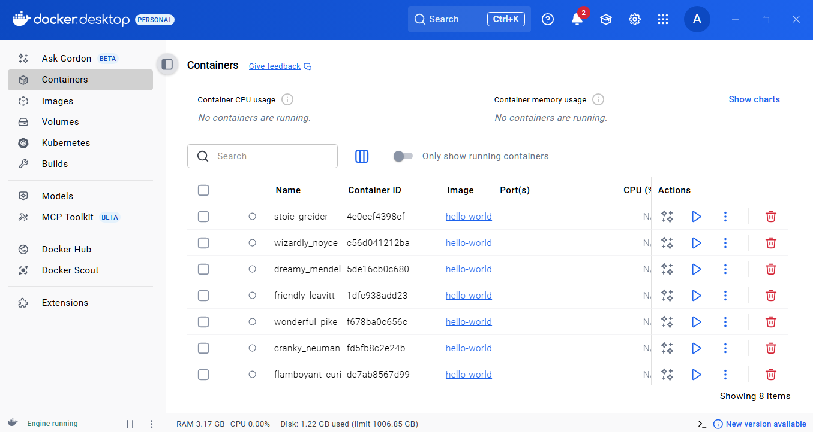
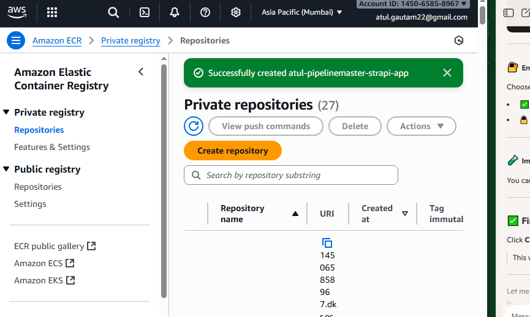
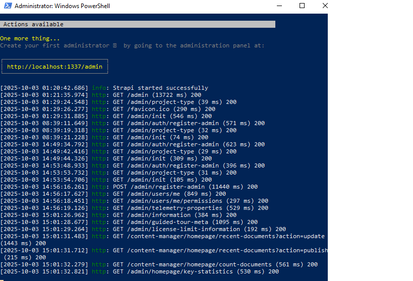
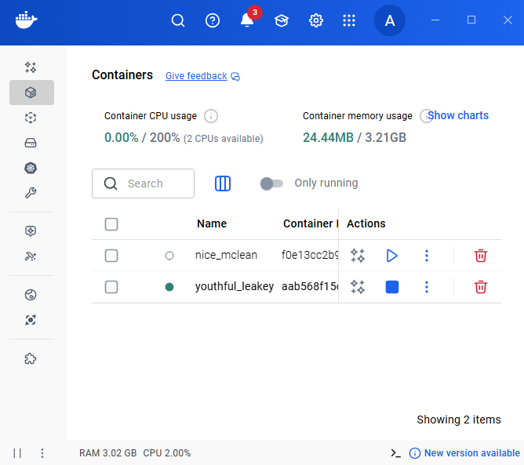

# ☁️ Cloud Automation Labs

## 🧭 Overview
This repository documents my internship-level backend automation project using AWS EC2, IAM, GitHub Actions, Docker, and Strapi. It demonstrates my ability to build reproducible cloud workflows and document them with screenshots and logs.

## 🛠️ Tools & Technologies
- AWS EC2 & IAM (role-based access control)
- Amazon ECR (private container registry)
- Docker Desktop (local container orchestration)
- GitHub Actions (CI/CD pipeline)
- Strapi CMS (backend API)
- PowerShell (log monitoring)

## 🚀 Features
- EC2 provisioning and IAM role setup
- Docker container management and ECR integration
- GitHub Actions workflow for backend deployment
- API integration with Strapi and HTML frontend
- Screenshot-based documentation of each step

## 📸 Screenshots
Here are visuals from the project:

- 
- 
- 
- 
- 
- 

## 📚 Documentation Highlights
- EC2 and IAM setup followed AWS best practices
- GitHub Actions used for automated deployment
- Docker containers built and pushed to ECR
- Strapi backend served API data to HTML frontend
- Logs and screenshots captured for reproducibility

## 🧠 What I Learned
- How to automate backend workflows using cloud-native tools
- How to document technical steps for recruiter visibility
- How to troubleshoot container and API integration issues

## 🧳 Portfolio Summary
Explore my pinned repositories for related projects:
- [`client-onboarding-demo`](https://github.com/AKGautam01/client-onboarding-demo) – Power Automate + backend workflow
- [`docker-swarm-cronjobs`](https://github.com/AKGautam01/docker-swarm-cronjobs) – Docker orchestration
- [`strapi-automation-pipeline`](https://github.com/AKGautam01/strapi-automation-pipeline) – CMS automation
- [`Atul-strapi-task1`](https://github.com/AKGautam01/Atul-strapi-task1) – Internship backend task
- [`strapi-cloud-template-blog-9dd1360b4f`](https://github.com/AKGautam01/strapi-cloud-template-blog-9dd1360b4f)
- [`strapi-cloud-template-blog-ec5a40ae36`](https://github.com/AKGautam01/strapi-cloud-template-blog-ec5a40ae36)

## 📬 Contact
For collaboration or remote opportunities:  
📧 `atul.gautam22@gmail.com`  
🌐 [GitHub Profile](https://github.com/AKGautam01)
